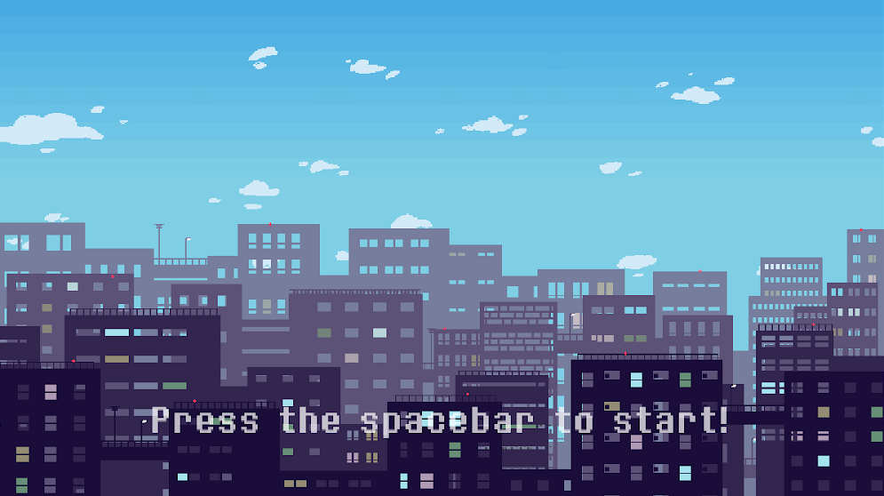

# Attack on the City

[Download the exe.](https://drive.google.com/file/d/1TFgxxeowzpbOUqTpUsw5PwU_tUkDhi35/view?usp=sharing)

[Watch a demo.](https://drive.google.com/file/d/12yQ5pLocnaU9INXNYn3OuMgC2SgwYnEK/view?usp=sharing)

A 2-player GameMaker action game about destroying green aliens before the time limit. If one of the players squash the other player, they get a higher score, but they might not kill all the aliens in time. 

The controls for player 1 are WASD and for player 2 Left, Up, Right and Down to move around, hover, and go down faster. 

I made the sprites and background on Photoshop and animated them on GameMaker. I made the background music on Logic Pro. The other sound effects are from [freesound.org](https://freesound.org/), and the font is [8bitoperator](https://fonts2u.com/8bitoperator-regular.font).

# Photos

