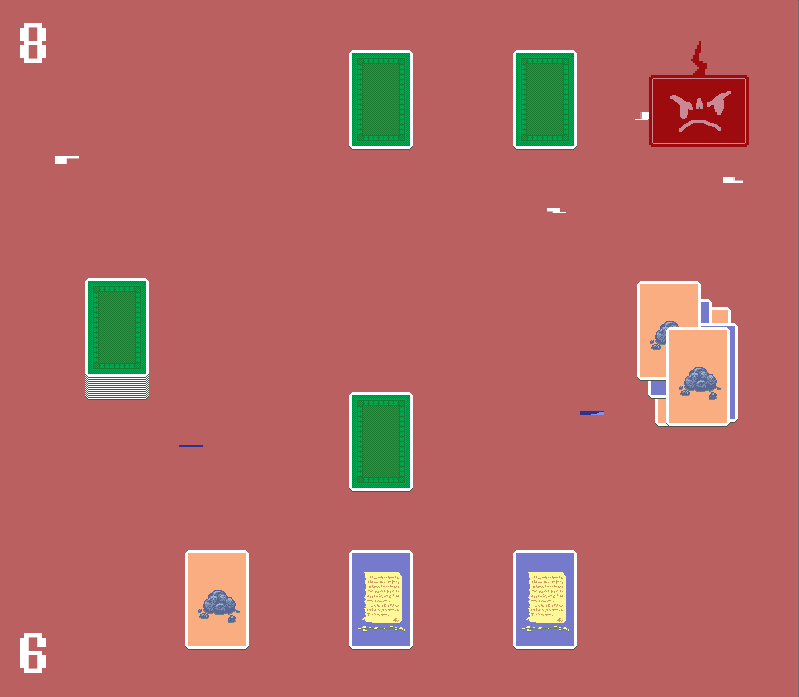
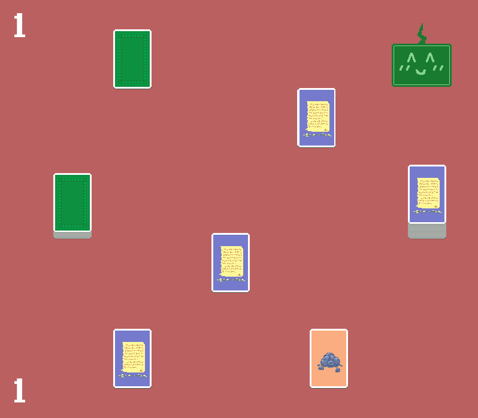

# Bad Card Game

[Play it on your browser](https://hatimb00.itch.io/bad-card-game)

A bad card game based on Rock Paper Scissor, made for my Intro to Game Dev class.The computer gets mad at you if you break the rules.

To break the rules, click on your opponent's cards, the discard pile, the CPU's score, or your score. To play normally, click on one of your cards.

I made the game and sprites on GameMaker. I borrowed and modified the code for the glitch effect from a [comment](https://forum.yoyogames.com/index.php?threads/solved-glitch-effect-in-game.31932/) on the yoyo games forum. The sounds I used are either from freesound.org (card shuffling, shifting, distributing, noise in case the computer is angry) or composed by me(win sound and lose sound).

# Screenshots

