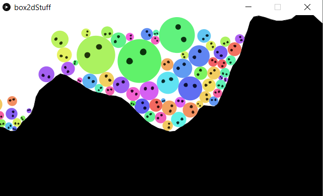

# Loco

[Link for the playable sim](https://drive.google.com/file/d/1RxfCsufqV1C7t0j473JSBxnMJ8ZEVDnW/view?usp=sharing)

This is a small physics simulation on Processing using the Box2D library. It's an attempt to emulate some of the physics in the PSP game Locoroco. Coded in Java using Processing.

The terrain is randomly generated everytime the simulation is opened. Dragging the mouse on the screen makes multi-colored balls appear. Pressing the space bar makes the balls fuse with each other into bigger balls. Pressing the left or right arrow makes the entire environment tilt.

