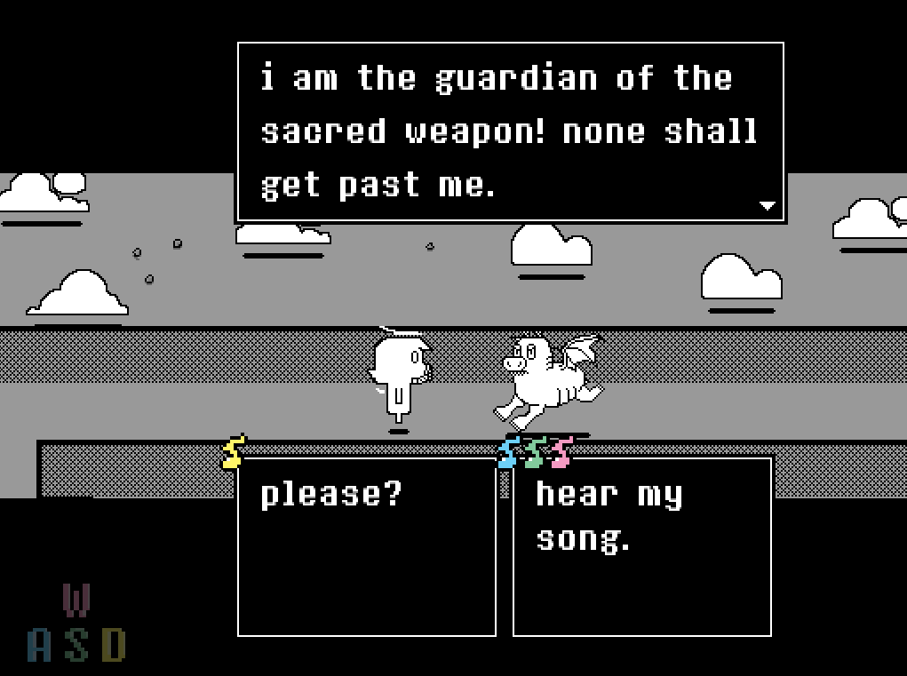
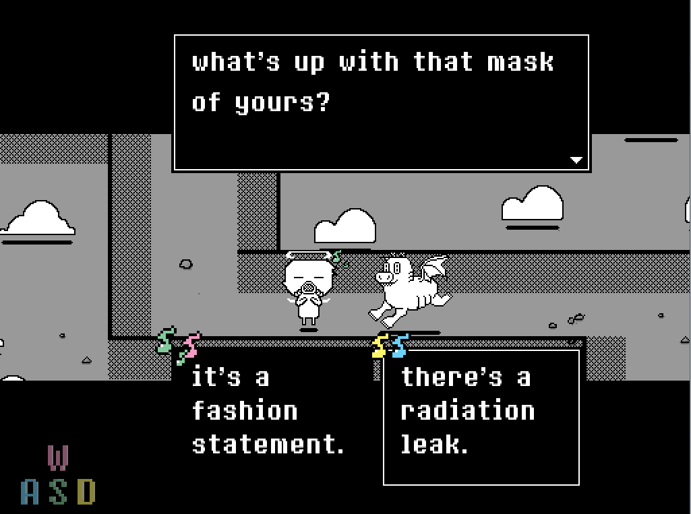
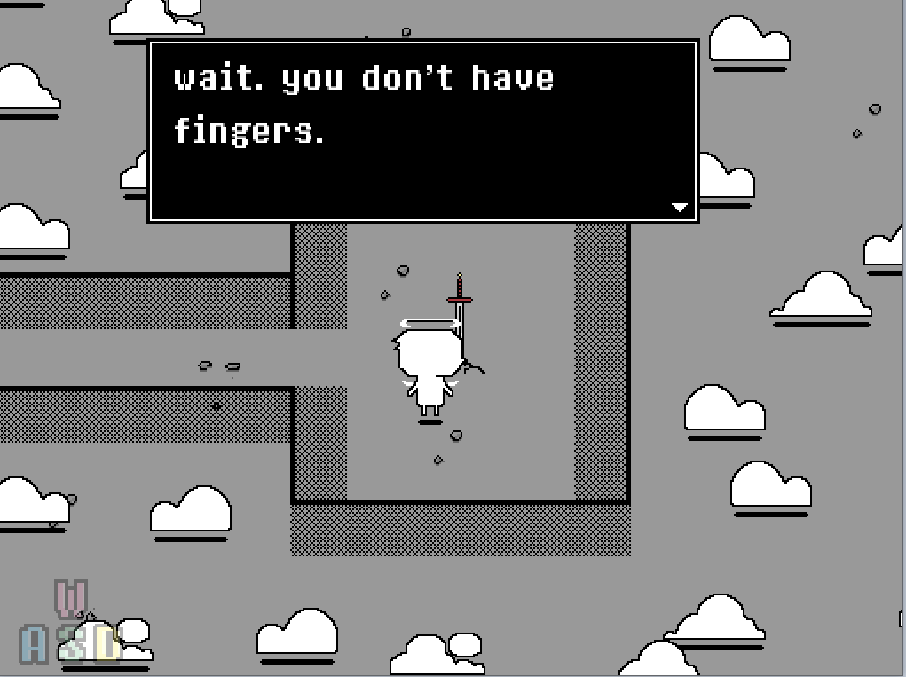

# Project Orpheus

[Watch a playthrough.]

[Download the exe.](https://drive.google.com/file/d/1btYoECxSsf-j4qLCHEcxVW7PUNvigs-O/view?usp=sharing)

[Play (a slow, buggy version) on your browser.](https://hatimb00.itch.io/orpheus)

In Project Orpheus, you play as an angel who wants to free their friend from prison. To do so, you must find your way through a maze and get past demonic pig jailers with your beautiful voice as your only weapon. 

The controls are directional arrows to move, WASD to sing, and the spacebar to interact or skip dialogue.

A rework of a narrative game made for my Intro to Game Dev class, I built Project Orpheus in GameMaker Studio and composed the music and most of the sound effects on CakeWalk Sonar. I used the [magical8bitoperator](http://www.ymck.net/en/download/magical8bitplug/) plug-in, Spitfire's [LABS](https://www.spitfireaudio.com/labs/), and a Gamelan instrument plug-in from [this website](http://bigcatinstruments.blogspot.com/). I also drew the sprites in Photoshop and animated them on GameMaker. The sound effects that I didn't make are from [freesound.org](https://freesound.org/), and the font I used is [8bitoperator](https://fonts2u.com/8bitoperator-regular.font). 

# Screenshots

