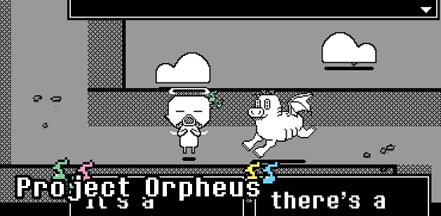
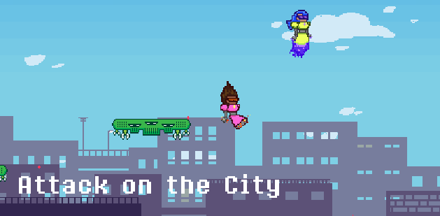
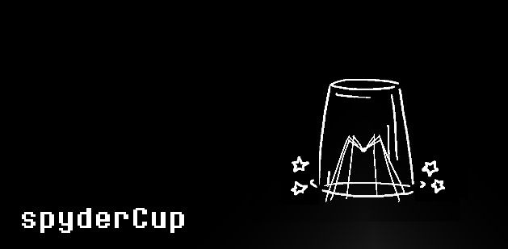
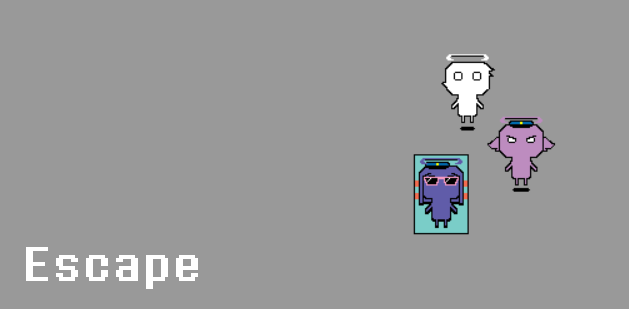
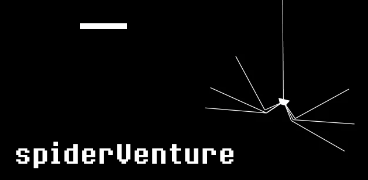
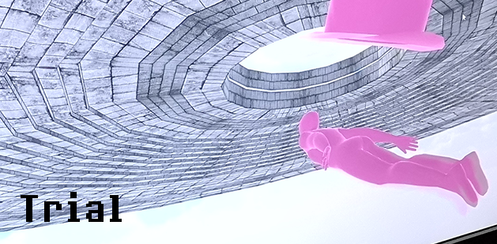
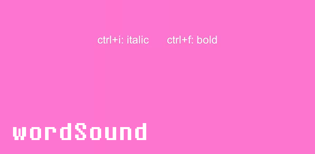
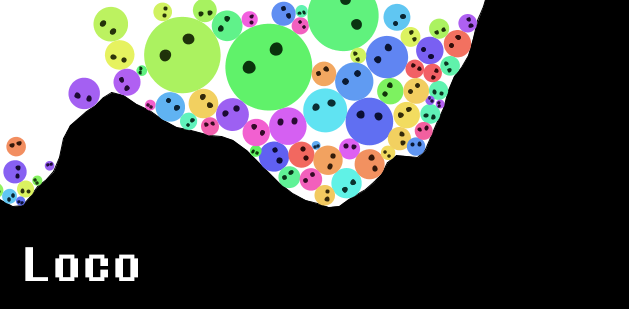

# Games And Other Projects:

A portfolio repository where I host some of the projects I worked on in the past.

The projects I am currently hosting here are:

A GameMaker 2-player narrative music game. I made the music and sound effects with CakeWalk Sonar.
[Find it here.](/Project%20Orpheus)

A GameMaker 2-player action game about destroying aliens. I made the music with Logic Pro.
[Find it here.](/Attack%20on%20the%20City)

A little Unity 2D rhythm game about squashing spiders. I made the music with CakeWalk Sonar.
[Find it here.](/spyderCup)

A GameMaker project where you play as an angel who has to break their friend out of prison, made in 2020.
[Find it here.](/Escape)

A Processing 2D game where you take care of a spider. I also made the music.
[Find it here.](/spiderVenture)

A Unity 3D game made for my Games and Play class in 2018.
[Find it here.](/Trial)

A Unity sound toy made for my Music and Gameplay class in 2020.
[Find it here.](/wordSound)

A Processing simulation where I try to replicate some of the physics in the game Locoroco using Box2D.
[Find it here.](/Loco)

A small p5.js game made for my Games and Play class in 2018.
[Find it here.](/unBoxing)

# Other Portfolios and Social Accounts:

[Soundcloud Account](https://soundcloud.com/hatim-benhsain)

[Instagram Art Account](https://www.instagram.com/hatimb00/)

[LinkedIn Account](https://www.linkedin.com/in/hatim-benhsain-b7a426175/)

[ArtStation Account](https://www.artstation.com/hatimbenhsain)
