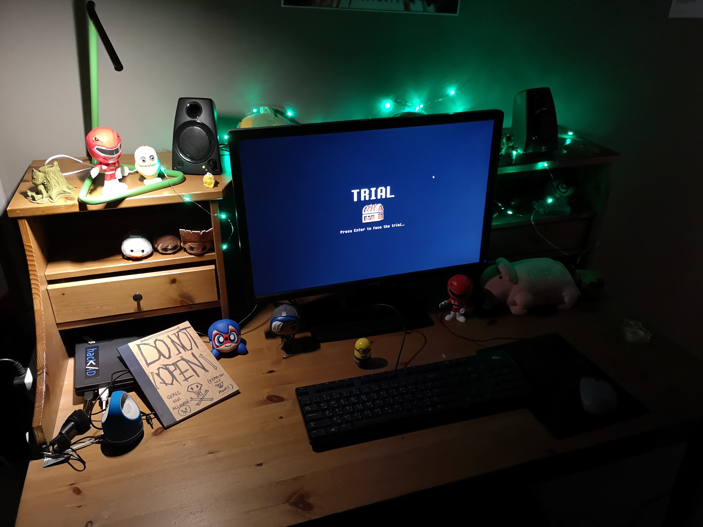
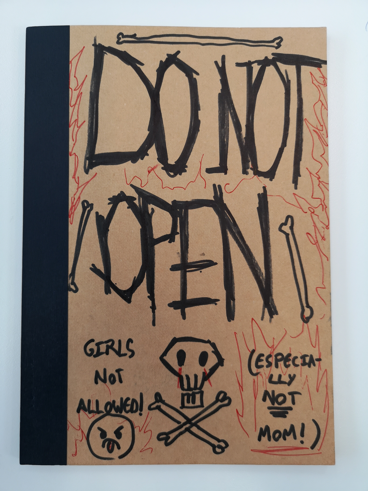
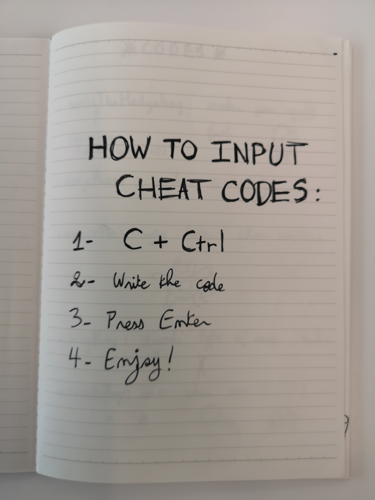
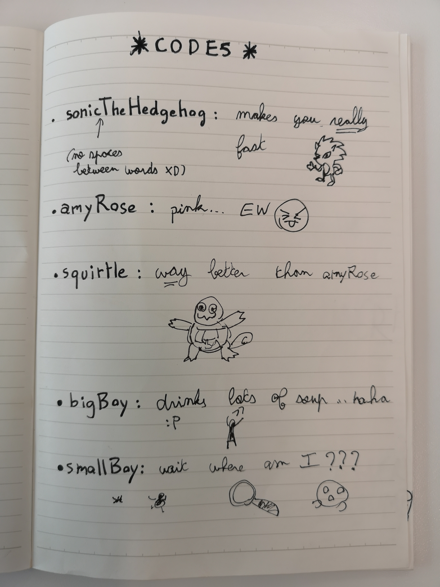
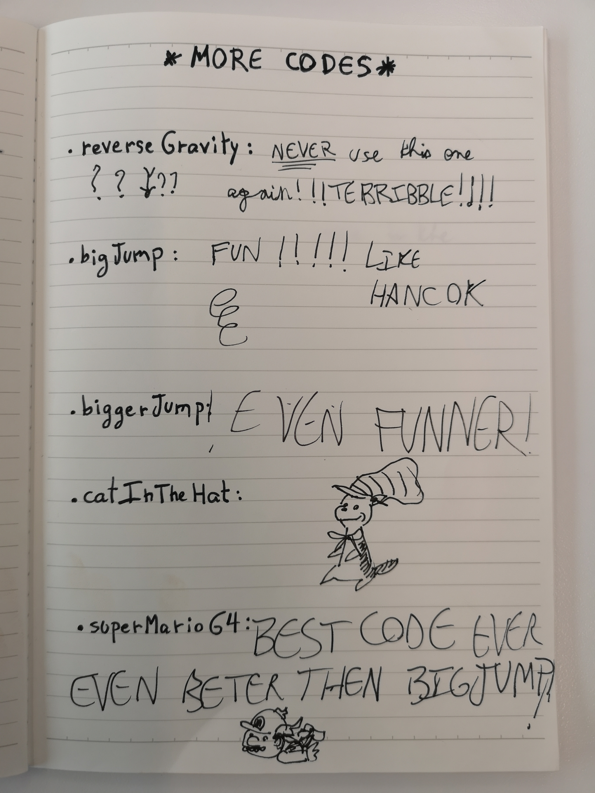

# Trial:

[Download link for the game](https://drive.google.com/open?id=1h-pPnjZvz_EUb7Aays-nSfl0Al5pnUT4)

A game disrupting the digital and analog worlds, where cheating is a valid part of the play experience. The game is a platformer that uses music from the Legend of Zelda series and assets from the Unity marketplace. It was inspired from me and my partner's childhood memories of looking up cheat codes online and noting them down to play around with. The game was presented as part of the Interactive Media showcase at the end of Fall 2018 in NYU Abu Dhabi.

As part of the game's presentation, we installed a desk that simulated a child's room. On it, a desk lamp shines on a notebook that says "DO NOT OPEN". Inside of the notebook are cheat codes that can either enhance, facilitate, or hinder the play experience. Because we wanted the player to experiment and play around with the codes, we made the game particularly hard to beat. However, it is still possible to win without cheating, which gives a different final outcome. 

I was in charge of implementing the game main physics and cheat mechanics as well as the second level. My partner made the first level.

# Photos:

## The setup:

## The book:

