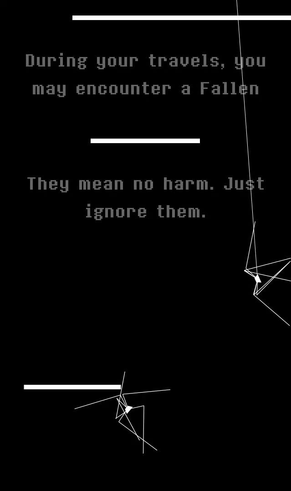

# spiderVenture

[A full playthrough](https://drive.google.com/file/d/1Sy90xKs5bfgtmEPUQB37OB3JtGD3QXBm/view?usp=sharing)

[A medley of the soundtrack I composed](https://soundcloud.com/hatim-benhsain/spider-medley)

A game where you play as a spider. The first part of the game is a descent through a black and white environment as the spider hangs form a thread and the player has to push it to avoid obstacles. The second part is a walking simulator where 3 buttons control 3 pairs of legs and the player is challenged to make the spider walk - or at least not fall on its head. The game was presented as part of the Interactive Media final showcase in Fall 2019, in NYU Abu Dhabi. I composed different tracks for the two parts that also change to a calmer version if no button is pressed for too long.

I made the game using Processing and the Box2D library. The code for the platforms was taken from Daniel Shiffman's Nature of Code, but the rest was me. I composed the sountrack on Logic Pro X using soundfonts from EarthBound and Chrono Trigger and the Magical 8bit Plug from YMCK. I communicated information from Processing to my Max patch to control the soundtrack using the oscP5 library.

During the development, I also tried teaching the spider to move efficiently using machine learning, but I didn't have time to go very far in that direction.

# photos

