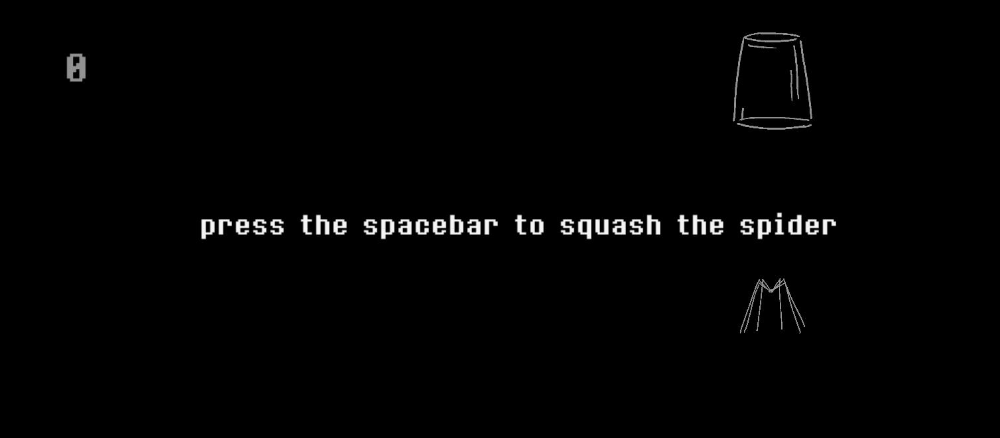
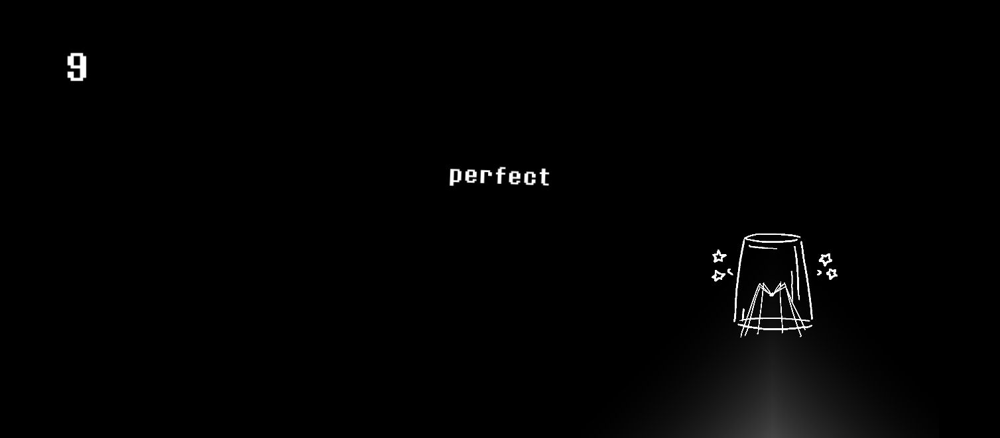
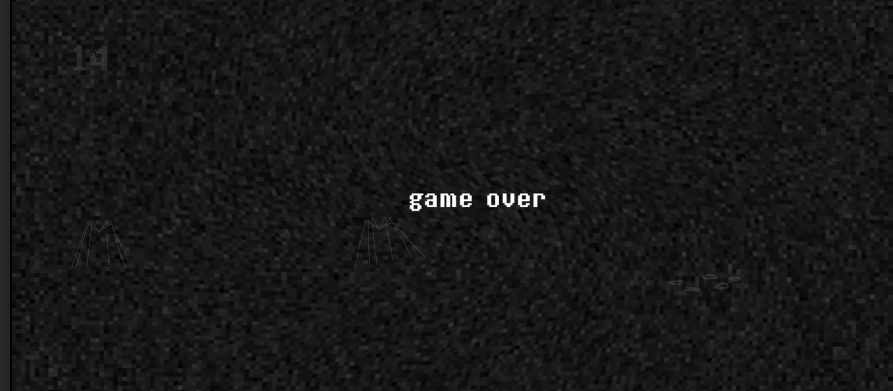

# spyderCup

[Download the exe.](https://drive.google.com/file/d/1wzNEpZjnphBMObemsJf-Qn4QhxWIzX8F/view?usp=sharing)

[Watch a demo.](https://drive.google.com/file/d/17DVfGv6Zgc_1qmULphP8MXmVfFbzOLzl/view?usp=sharing)

A short Unity 2D game where you have to trap spiders under a glass to the beat. Putting the cup down when there are no spiders can shatter the glass, and shattering the glass more than 4 times causes a game over. If the glass is intact, the game ends when the music ends, and the score is calculated on accuracy and number of trapped spiders.

The only control is the spacebar to put the cup down or start/restart a game. 

I made the music on CakeWalk Sonar with Snes soundfonts and the [Magical 8bit](http://www.ymck.net/en/download/magical8bitplug/) plug-in, and I edited files from [freesound.org](https://freesound.org/) on Audacity for the sound effects. I made the sprites on Photoshop, and I used the [8bitoperator](https://fonts2u.com/8bitoperator-regular.font) font.

# photos

