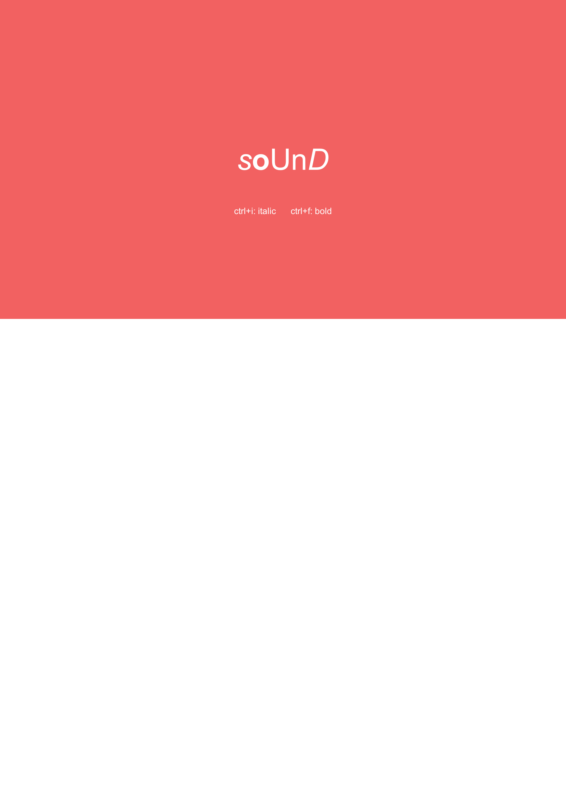

# wordSound

[Download the executable](https://drive.google.com/file/d/1lLwn35caCUoqEOtGblJvK2yLA9otU7zJ/view?usp=sharing)

[View a demo](https://drive.google.com/file/d/1z8zHdtsN5Go7zjuPteJj6ASSzUPN8RCL/view?usp=sharing)

A sound toy. Type letters to hear them every four beats, press ctrl+i to make them italic, ctrl+f to make them bold, caps lock to capitalize them, backspace to erase the last letter, and drag your mouse on the screen to change the tempo. italics, bold, and caps are higher pitched.

[The letter sound files are from here.](https://evolution.voxeo.com/library/audio/prompts/alphabet/index.jsp)

# photos

